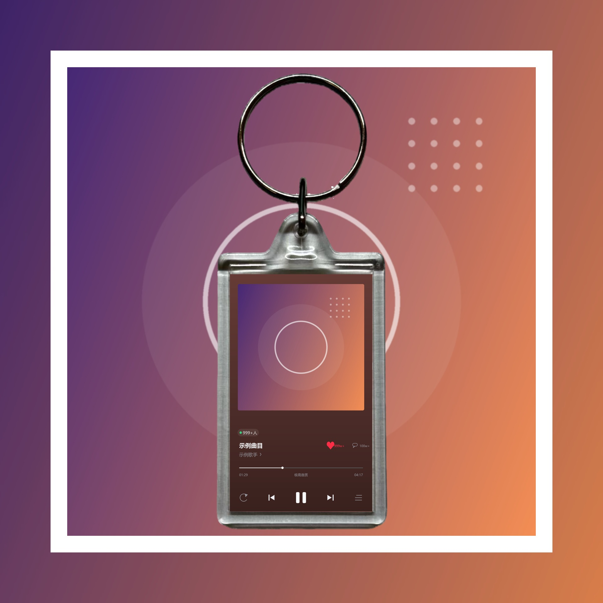
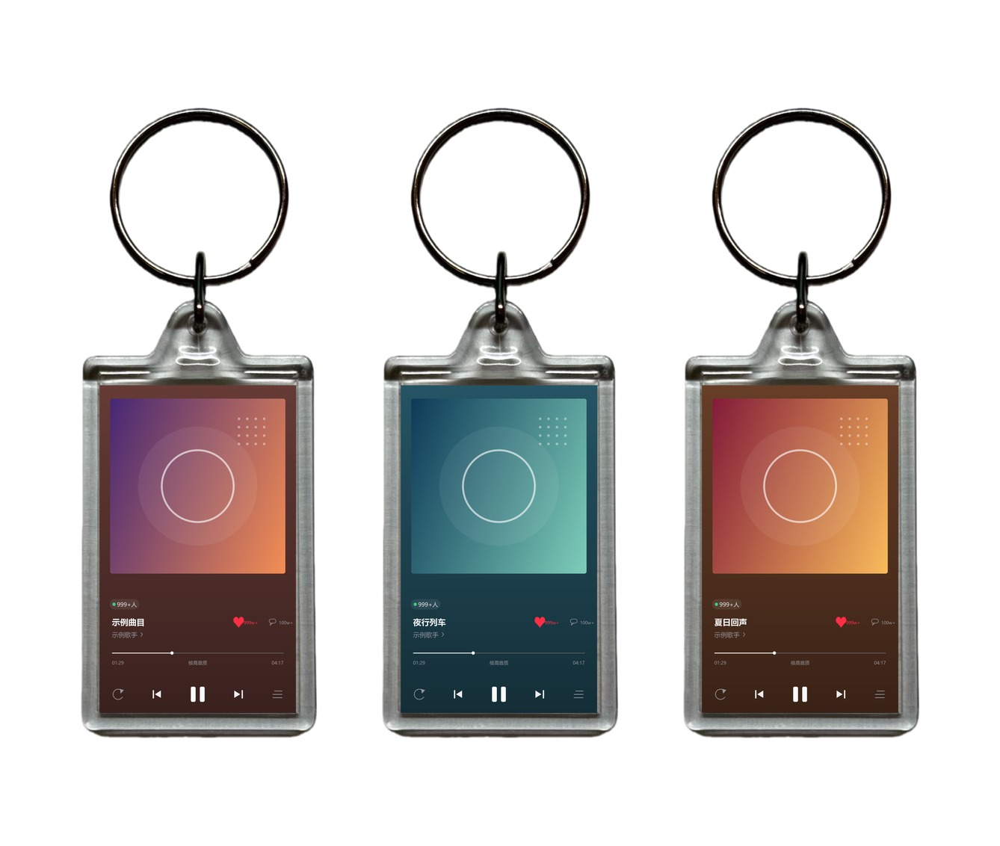

# Minuet · 音乐卡片工坊

把一张专辑封面，变成可以直接印刷或上架的商品图。

给一张封面图，它能产出三种成品：**播放界面卡片**（30×50mm 实物尺寸）、**钥匙扣商品图**（1920×1920）、**黑胶唱片图**。



> 上图由本仓库代码生成（`tools/make_demo_assets.py`），使用程序绘制的抽象封面，不含任何第三方素材。

**白底商品图**（电商商品图形态，纯白底 + 钥匙扣当主角，可拼版）：



---

## 功能一览

| 功能 | 说明 | 脚本 |
|---|---|---|
| 播放界面 | 复刻音乐 App 深色播放页，**1181×1968 @1000DPI = 30×50mm** 实物比例 | `tools/make_player.py` |
| 钥匙扣商品图 | **1920×1920** 五层合成：模糊底图 → 白卡纸 → 清晰封面 → 播放界面 → 钥匙扣贴片 | `tools/make_keychain.py` |
| 白底商品图 | 纯白底 / 透明底，钥匙扣放大当主角，竖长 + 方形两种画布，可拼版总览 | `tools/make_keychain_shop.py` |
| 黑胶唱片图 | 黑胶风格方形卡片 | `tools/make_vinyl.py` |
| 批量套装 | 按歌手抓取热门歌曲，一次产出一整套 + 总览图 | `tools/make_set.py` |
| 网页工作台 | 本地可视化界面，勾选即出图，支持打包 ZIP 下载 | `workbench/server.py` |

播放界面的每个元素（导航、封面、标签、歌名、进度条、控制按钮）都是**程序化绘制**的，
不依赖字体图标，也不依赖任何截图底图，因此分辨率可以任意缩放。

---

## 环境要求

- **Python 3.9+**
- 依赖：`Pillow`、`numpy`、`requests`
- **一款中文字体**（否则标题会显示成方块，见下方「配置」）

支持 Windows / macOS / Linux。

## 安装

```bash
git clone <本仓库地址>
cd <仓库目录>

# 创建虚拟环境（推荐）
python -m venv .venv

# Windows
.venv\Scripts\pip install -r requirements.txt

# macOS / Linux
.venv/bin/pip install -r requirements.txt
```

## 快速开始

### 方式一：网页工作台（推荐）

```bash
# Windows：双击
启动工作台.bat

# macOS / Linux
./start.sh
```

浏览器会自动打开 `http://127.0.0.1:8765`。输入歌手名 → 选歌 → 勾选「同时出钥匙扣商品图」/「同时出白底商品图」→ 开始生成。
产物会落到 `outputs/工作台/<任务id>/`。

两个商品图开关的区别：

- **钥匙扣商品图**（`keychain/`）—— *场景图*。1920×1920，封面模糊铺满当背景 + 白卡纸相框，钥匙扣缩在中间当点缀，像一张「效果图」。
- **白底商品图**（`shop/`）—— *商品图*。没有背景大图，纯白底或透明底，钥匙扣放大当主角，竖长 / 方形两种画布，并附拼版总览。
  可选「透明底 PNG」，直接贴到任意底色或电商详情页上。

### 方式二：命令行

```bash
cd tools

# 1) 单张播放界面
python make_player.py --cover 封面.jpg --title 歌名 --artist 歌手 \
                      --duration 257 --played 0.35 --width 1181 --ratio 1.6667 \
                      --out player.png

# 2) 单张钥匙扣商品图（场景图）
python make_keychain.py --cover 封面.jpg --player player.png --out keychain.png

# 3) 单张白底商品图
python make_keychain_shop.py --cover 封面.jpg --player player.png --out shop.png

# 4) 按歌手批量出一整套
python make_set.py 周杰伦 --top 5 --out ../outputs/周杰伦-热门前5
python make_keychain.py --batch ../outputs/周杰伦-热门前5          # 场景图
python make_keychain_shop.py --batch ../outputs/周杰伦-热门前5     # 商品图

# 只出竖长白底、不要拼版
python make_keychain_shop.py --batch ../outputs/周杰伦-热门前5 \
        --canvas long --bg white --no-grid
```

不带任何素材参数直接运行 `make_keychain.py`，会用仓库自带的抽象占位图出一张演示图。

---

## 目录结构

```
.
├── tools/                     命令行脚本
│   ├── fetch163.py            网易云：搜索、封面、歌曲信息
│   ├── fetch_qq.py            QQ 音乐：搜索、封面、热门歌曲
│   ├── make_player.py         播放界面卡片
│   ├── make_vinyl.py          黑胶唱片图
│   ├── make_keychain.py       钥匙扣商品图（五层合成，场景图）
│   ├── make_keychain_shop.py  白底商品图（纯白/透明底，竖长/方形 + 拼版）
│   ├── keychain_build.py      贴片标定：从实拍素材反解 RGBA 叠加层
│   ├── make_set.py            批量套装 + 总览图
│   ├── make_demo_assets.py    生成仓库自带的抽象示例素材
│   ├── fonts.py               跨平台中文字体探测
│   ├── noproxy.py             绕过本机代理访问 127.0.0.1
│   └── start_bg.py            脱离会话后台启动工作台
├── workbench/                 网页工作台
│   ├── server.py              HTTP 后端（仅标准库，只绑 127.0.0.1）
│   └── index.html             单页前端
├── assets/
│   ├── keychain/
│   │   ├── keychain_overlay.png   钥匙扣 RGBA 叠加层（功能必需）
│   │   └── tone_curve.json        色调曲线标定数据（功能必需）
│   └── demo/                  抽象示例素材（无版权）
├── 启动工作台.bat              Windows 启动器
├── start.sh                   macOS / Linux 启动器
└── requirements.txt
```

---

## 配置

所有配置都通过**环境变量**完成，不需要改代码。

| 变量 | 默认值 | 说明 |
|---|---|---|
| `MINUET_PORT` | `8765` | 工作台端口 |
| `MINUET_FONT_BOLD` | 自动探测 | 粗体字体文件路径，如 `C:\Windows\Fonts\msyhbd.ttc` |
| `MINUET_FONT_REG` | 自动探测 | 常规字体文件路径 |
| `PLAYER_BG` | `l3` | 播放页背景配色。`l3` = 取封面主色并定标亮度；`legacy` = 旧的平均色方案 |

字体默认会自动探测：Windows 用微软雅黑，macOS 用苹方，Linux 用思源黑体 / Noto CJK / 文泉驿。
都找不到时会给出明确的安装提示。

```bash
# 例：指定字体并换端口
export MINUET_FONT_BOLD=/usr/share/fonts/opentype/noto/NotoSansCJK-Bold.ttc
export MINUET_PORT=9000
./start.sh
```

---

## 常见问题

**中文显示成方块**
系统没有中文字体。安装一款（Linux: `sudo apt install fonts-noto-cjk`），
或用 `MINUET_FONT_BOLD` / `MINUET_FONT_REG` 指定字体文件。

**浏览器打不开工作台**
本机代理软件可能把 `127.0.0.1` 也代理走了。把 localhost 加入代理白名单，
或临时关闭代理。诊断脚本：`python tools/diag_net.py`。

**提示缺少模块**
没装依赖。执行 `pip install -r requirements.txt`。

**改了配色不生效**
`workbench/server.py` 在**模块级**导入 `make_player`，常驻进程持有旧模块。
改完配置需要重启工作台。

---

## 数据来源与免责声明

⚠️ **请在使用前阅读**

- 本项目通过各音乐平台的**公开接口**获取歌曲信息与封面图片，用于个人学习与设计实践。
- **封面图片的版权归原平台及版权方所有**。本项目不存储、不分发任何音乐或封面资源。
- 生成的作品**仅供个人学习、研究和设计参考**，不得用于商业用途或任何侵犯版权的场景。
- 请遵守各音乐平台的用户协议与相关法律法规。因使用本项目产生的任何法律责任，由使用者自行承担。

如果你要用于商业产品，请使用你有合法授权的素材。

## 开源协议

[MIT](LICENSE)
